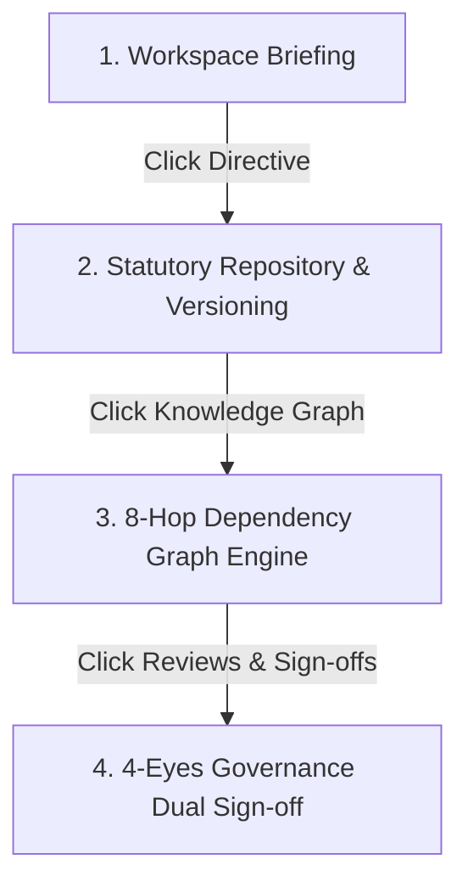

# ReguGuard AI – Platform Quick Start & Evaluation Guide

Welcome to **ReguGuard AI**, an AI-powered Regulatory Intelligence Platform built for enterprise banking, financial services, and capital markets.

---

## 🚀 60-Second Onboarding Walkthrough

### 1. Interactive In-App Guided Tour
Click **`[Guided Tour]`** in the top navigation bar at [http://localhost:3000](http://localhost:3000) for a guided step-by-step tour.

---

### 2. Recommended 4-Step Evaluation Flow



#### Step 1: Check the Morning Briefing (`Workspace`)
- Go to **[http://localhost:3000](http://localhost:3000)**.
- Review top metric callouts (`Requires Review`, `Waiting Sign-off`, `Compliance Tasks`, `Enforcement Countdown`).
- Click quick filter chips (`[High Impact]`, `[Needs Review]`, `[RBI Circulars]`).

#### Step 2: Trace 8-Hop Dependency Chains (`Knowledge Graph`)
- Click **Knowledge Graph** in the left sidebar.
- Inspect the interactive relationship chain mapping statutory circulars to IT applications:
  `RBI Circular` ➔ `Section 4.1` ➔ `Requirement (2-Yr KYC)` ➔ `Internal Control (CTRL-KYC-04)` ➔ `Policy (POL-KYC-2026)` ➔ `Department (Retail Banking)` ➔ `App (Core Banking)` ➔ `Task`.

#### Step 3: Enforce Dual-Control Governance (`Reviews & Sign-offs`)
- Click **Reviews & Sign-offs** in the left sidebar.
- Inspect tasks waiting for legal sign-off under the **4-Eyes Principle Stepper**:
  - `1. Compliance Officer Review` (Sarah Jenkins)
  - `2. General Counsel Sign-off` (David Vance)
- Enter legal notes and click **`[Approve & Sign Off]`**. The platform generates an immutable cryptographic signature hash (`SIG-4EYES-8A9F21B`) logged to the audit ledger.

#### Step 4: Ask Statutory Questions (`AI Copilot`)
- Click **AI Copilot** in the left sidebar.
- Type questions like: *"What is the mandatory KYC re-verification cadence for high-risk accounts?"*
- The AI retrieves grounded answers with exact statutory circular citations (*RBI Section 4.1*) and 0% hallucination guarantees.

---

## 🛠 Command Line Directives

### Start Local Servers
```bash
# FastAPI Backend Server (Port 8000)
cd backend && python -m uvicorn app.main:app --port 8000

# React SPA Frontend (Port 3000)
cd frontend && npm run dev
```

### Production Docker Deployment
```bash
docker-compose up --build
```
