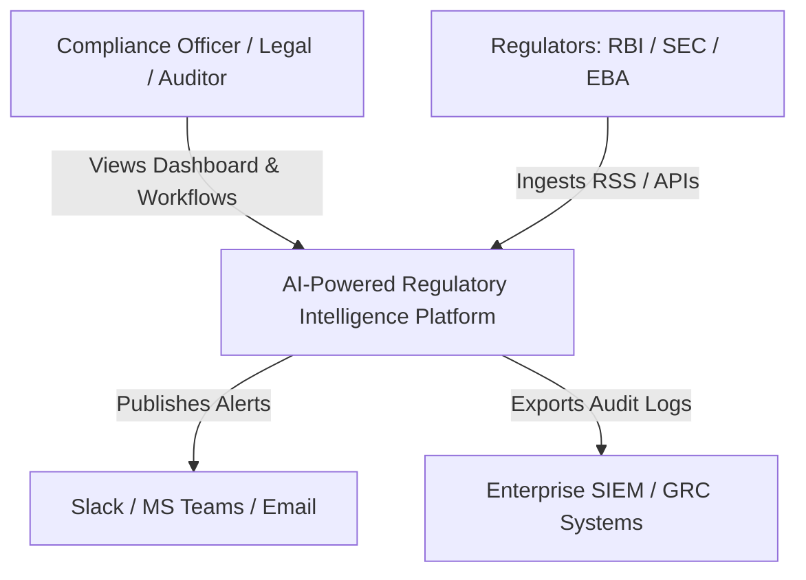
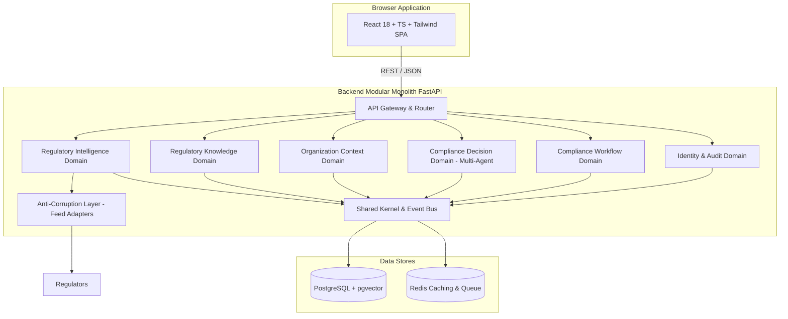
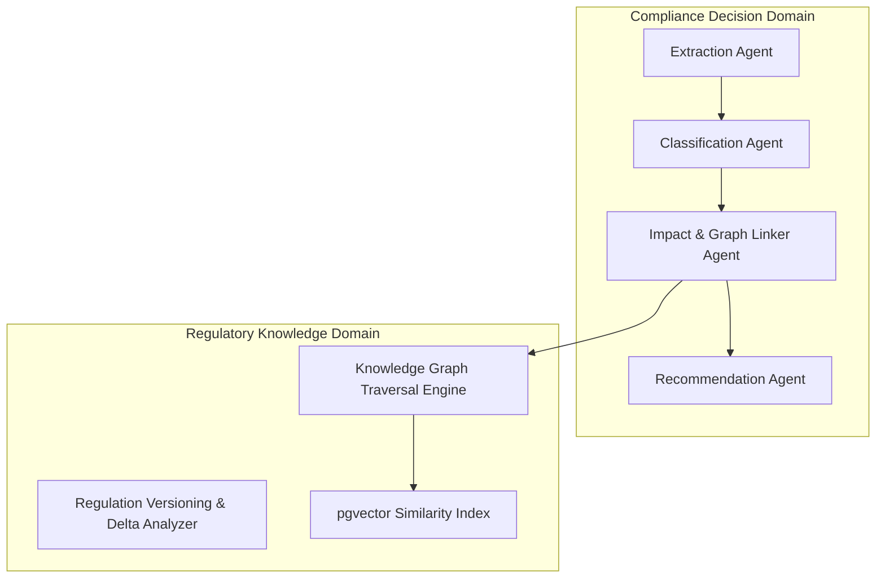
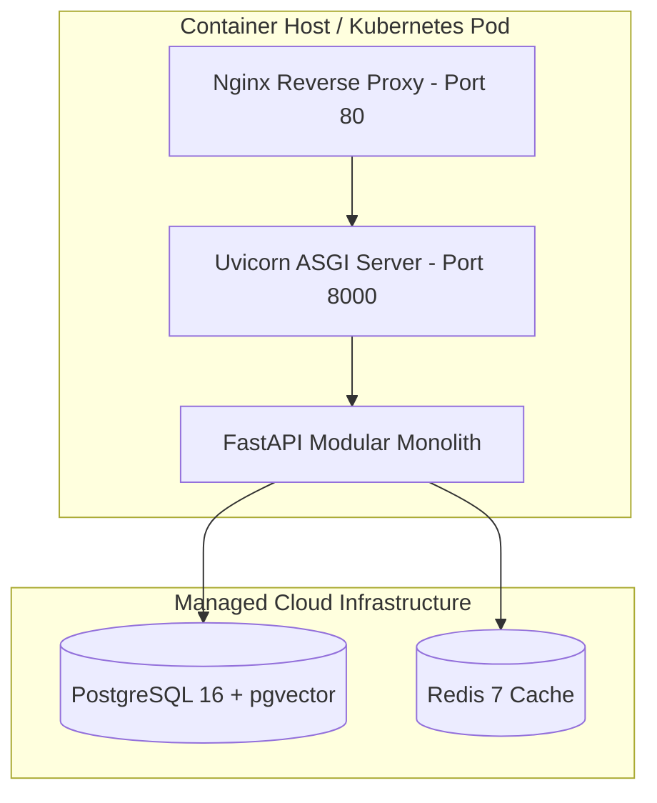

# Enterprise Architecture & Solution Blueprint

## System Overview
The **AI-Powered Regulatory Intelligence Platform** automates end-to-end regulatory change management for enterprise banking, financial services, and capital market institutions. Built using **Domain-Driven Design (DDD)** as a **Modular Monolith**, the system ingests raw statutory feeds, translates external data formats via an **Anti-Corruption Layer (ACL)**, constructs a **Structured Regulatory Knowledge Ontology**, maps dependencies in an **Enterprise Knowledge Graph Chain**, orchestrates AI reasoning via a **Multi-Agent AI Pipeline**, and manages **4-Eyes Dual Control Compliance Workflows**.

---

## 1. C4 Architecture Diagram Suite

### C4 Level 1: System Context Diagram

### C4 Level 2: Container Diagram (Modular Monolith)

### C4 Level 3: Component Diagram (Compliance Decision & Knowledge Graph)

### C4 Level 4: Code & Deployment Diagram

---

## 2. Quality Attribute Scenarios (Non-Functional Matrix)

| Attribute | Scenario | Architectural Strategy |
| :--- | :--- | :--- |
| **Scalability** | Ingestion spikes during regulatory circular release hours. | Stateless domain handlers; background crawling offloaded to Redis tasks; vector search indexed with pgvector IVFFlat. |
| **Security** | Strict data isolation and access auditability. | Role-Based Access Control (RBAC), TLS 1.3 encryption, AES-256 data encryption at rest, append-only cryptographic audit logs. |
| **Maintainability** | Change in external regulator feed formats (e.g., SEC EDGAR API shift). | Anti-Corruption Layer (ACL) adapters isolate internal domain models from external schema changes. |
| **Explainability** | Legal Counsel auditing AI task recommendation reasons. | Citation Grounding Engine linking assertions directly to statutory clause text with confidence scores (0-1.0). |
| **Availability** | Component failure in web server. | Health check probes (`/health`) with automated container restart policies. |

---

## 3. Architecture Decision Records (ADR Index)
- `ADR-001`: Domain-Driven Design Bounded Contexts
- `ADR-002`: PostgreSQL + pgvector Unified Storage
- `ADR-003`: FastAPI Async Web Framework
- `ADR-004`: Event-Driven Decoupling
- `ADR-005`: Multi-Agent AI Pipeline Orchestration
- `ADR-006`: Modular Monolith Delivery Strategy
- `ADR-007`: RBAC and Cryptographic Audit Ledger
- `ADR-008`: Telemetry & Prometheus Observability
- `ADR-009`: RAG AI Evaluation Harness
